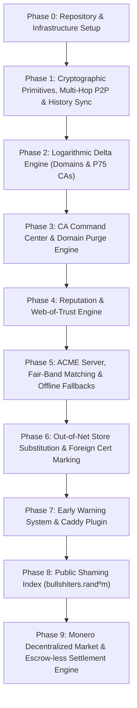

# 🗺️ `randbotd` Specification & Functionality Tracker

This document tracks all planned, ongoing, and completed feature modules, architectural primitives, and ecosystem integrations for `randbotd`.

---

## 📊 Feature Status Legend

| Status Icon | Meaning |
| :---: | :--- |
| 🟢 | **Completed & Verified** |
| 🟡 | **In Active Development** |
| 🔴 | **Infrastructure / Planned** |
| ⚪ | **Conceptual / Specification Draft** |

---

## 🏗️ 1. Core Daemon & P2P Network Infrastructure

| Feature ID | Module Name | Description | Status |
| :--- | :--- | :--- | :---: |
| `NET-01` | **Ed25519 Node Identity** | Node keypair generation, cryptographic identity persistence, and handshake framing. | 🟢 |
| `NET-02` | **Multi-Hop P2P Gossip Engine** | Multi-hop gossip protocol (unlike single-hop designs) for resilient, network-wide propagation of votes, CA declarations, and signed address updates (`AddressAnnouncement`). Includes seen-cache deduplication, UPnP port mapping, and phonebook seed resolution (`therandomconsortium.org:43210`). | 🟢 |
| `NET-03` | **Multi-Network Proxy Integration & Declarative Ports** | Config file options to delegate privacy transport to external Tor SOCKS5 (`tor_socks_proxy`) and I2P SAM/HTTP/SOCKS (`i2p_proxy_port`, `sam_port`) local proxies without embedding runtime binaries, adhering to lean daemon architecture. | 🔴 |
| `NET-04` | **Local Embedded Database** | Fast transactional storage (Sled/RocksDB/SQLite) for local CA state, votes, and certificates. | 🔴 |
| `NET-05` | **Full History Catch-Up & Anti-Entropy Protocol** | Node-bound monotonic integer + linked hash hybrid event log (`seq`, `prev_hash`). Anti-entropy sync exchanges node-scoped range vectors (`Node_A: [1..N]` with gap lists) via a self-terminating ping-pong range intersect protocol (with Merkle root fallback for heavy fragmentation), enabling offline peers to reconcile missing logs with zero coin overhead. | 🔴 |
| `NET-06` | **Infrastructure / Headless Node Mode (`--mode=headless`)** | Daemon flag for non-interactive nodes (e.g., home servers for Caddy TLS requests or CLI CAs). Headless nodes relay P2P messages and verify PoW, but are strictly prohibited from casting votes, excluded from active voter pools ($N_{\text{active\_voter\_nodes}}$), and excluded from network voter behavioral heuristics. | 🔴 |
| `NET-07` | **Do-Not-Advertise IP Config (`do_not_advertise_ip`)** | Configuration flag allowing privacy-focused nodes to suppress broadcasting clearnet IPv4/v6 addresses, advertising `.onion` or `.i2p` hidden service addresses exclusively. | 🔴 |
| `NET-08` | **Overlay Peer Discovery & Phonebook Sharing Engine** | P2P address book (phonebook) exchange protocol between connected peers + CLI/config manual peer importing (`randbotctl peer import` / seed lists), overcoming Tor exit / I2P outproxy port restrictions. | 🔴 |

---

## 🔑 2. Root & Intermediate CA Engine (`Publish CA`)

| Feature ID | Module Name | Description | Status |
| :--- | :--- | :--- | :---: |
| `CA-01` | **Custom Subject Metadata Engine** | Configurable creation of root/intermediate CAs with custom Subject Name, Emissor, O, and OU fields. | 🔴 |
| `CA-02` | **Cryptographic Agility Suite** | Multi-algorithm key generation and certificate signing: RSA-4096, ECDSA P-384, and Ed25519. | 🔴 |
| `CA-03` | **Multi-Network Domain Proofs** | Verification of domain control via DNS TXT, Handshake record, Tor HTTP/TLS-ALPN, and I2P LeaseSets. | 🔴 |
| `CA-04` | **P2P Cert Chain Broadcasting** | Automated broadcast of published CAs, intermediate cert chains, and CRLs across the P2P swarm. | 🔴 |
| `CA-05` | **X.509 Certificate Builder** | Standard-compliant X.509 v3 certificate builder with custom extensions for WoT signatures. | 🔴 |
| `CA-06` | **CA Command Center Dashboard** | Management control plane for CA operators to monitor domain health, issue CRLs, rotate keys, and analyze trust metrics. | 🔴 |
| `CA-07` | **Bad-Domain Purge Engine** | Allows CAs to actively revoke/purge UTW or abusive domains (enabling affected legitimate domains to perform early renewal/migration). | 🔴 |
| `CA-08` | **Configurable Certificate Parameters (Custom TTL)** | Allows CAs to specify custom issuance parameters, such as custom certificate validity/TTL (Time-To-Live). | 🔴 |

---

## ⚖️ 3. Reputation & Web-of-Trust Engine (`Vote TW / UTW`)

| Feature ID | Module Name | Description | Status |
| :--- | :--- | :--- | :---: |
| `REP-01` | **Proof-of-Work Challenge Engine** | Dynamic PoW puzzle generator (SHA-256 / Equihash) required for vote submission. | 🔴 |
| `REP-02` | **1-Vote-Per-Node Dynamic Voting** | State machine enforcing 1 active vote per node per domain with real-time mind-changing support. | 🔴 |
| `REP-03` | **Behavioral Score & Weight Ponderation** | Historical voter reputation engine scaling down voting power for detected review-bombers/Sybil nodes. | 🔴 |
| `REP-04` | **Lazy Evaluation Engine** | On-demand computation of domain/CA trust scores and $\Delta$ windows. Automatically rescales $\Delta$ when active network node count $N_{\text{active\_nodes}}$ expands. | 🔴 |
| `REP-05` | **CA Rating Propagation Engine** | Calculation of a CA's public rating as the weighted average of trust scores of all issued domains. | 🔴 |
| `REP-06` | **Bi-Directional Image Cleaning** | Mechanisms for CAs to boost rating via domain revocations, and domains to recover from review-bomb strikes. | 🔴 |
| `REP-07` | **Heuristic Cluster Ponderation Penalties** | Detects behavioral collusion rings and suspicious voting correlation. Invalid network interactions (e.g. fraudulent purges) degrade the voter ponderation of the offending node AND all heuristically linked cluster nodes. | 🔴 |

---

## 🎯 4. Fair-Band ACME Certificate Allocation (`GetCert`)

| Feature ID | Module Name | Description | Status |
| :--- | :--- | :--- | :---: |
| `ACME-01` | **ACME v2 Protocol Adapter** | RFC 8555 compliant endpoints (`/acme/directory`, `/acme/new-order`, `/acme/finalize`). | 🔴 |
| `ACME-02` | **50% Baseline Initializer** | Initializing new domains and CAs at a neutral 50% baseline score with 0 votes ($\Delta = \pm 50\%$). | 🔴 |
| `ACME-03` | **Randomized Fair-Band Matching ($\pm \Delta$)** | Matching domain cert requests to CA pools within dynamic confidence tolerance window ($\pm \Delta$). | 🔴 |
| `ACME-04` | **Logarithmic Dynamic Delta ($\Delta$) Engine for CA Matching** | Used specifically during certificate generation (`GetCert`) to compute matching tolerance ($\pm \Delta$) between domain and candidate CAs. Starts at $\pm 50\%$ for 0 votes and decays logarithmically based on vote count vs $N_{\text{active\_nodes}}$ (domain votes for domain $\Delta$; P75 domain vote ensemble for CA $\Delta$). Clipped at $[0\%, 100\%]$ and $\Delta \ge 0$, naturally widening on lazy evaluation as network node count grows. | 🔴 |
| `ACME-05` | **CA Operator Risk Floor Configurator** | Allowing CAs to set custom minimum reputation acceptance thresholds for domain issuance. | 🔴 |
| `ACME-06` | **Emergency Default Fallback CA** | Provisions temporary, short-TTL certificates if a randomly matched P2P CA is currently offline, ensuring zero downtime while waiting for full issuance. | 🔴 |
| `ACME-07` | **`--only-online` Filter Selection** | Client flag allowing domain owners to restrict fair-band matching strictly to active/online CAs for immediate cert issuance (lowers pool size). | 🔴 |

---

## 🌐 5. Out-Of-Net Trust Substitution & Foreign Certificate Engine

| Feature ID | Module Name | Description | Status |
| :--- | :--- | :--- | :---: |
| `OUT-01` | **System Trust Store Substitution** | Engine allowing `randbotd` to substitute or augment default OS / browser trusted root certificate stores. | 🔴 |
| `OUT-02` | **Foreign Certificate Ingestion** | Support for ingesting self-signed certificates, Caddy internal CA certs, and traditional ICANN certificates. | 🔴 |
| `OUT-03` | **`out-of-net` Cryptographic Marking** | Mandatory tagging and isolation of foreign/ICANN/self-signed certs as `out-of-net` to distinguish them from native peer-voted `randbotd` CAs. | 🔴 |

---

## 📬 6. Proactive Early Warning & Inbox System

| Feature ID | Module Name | Description | Status |
| :--- | :--- | :--- | :---: |
| `NOTIF-01` | **Domain Owner Inbox Alerts** | Automated P2P notification sent to TW domain owners when their hosting CA drops into UTW status. | 🔴 |
| `NOTIF-02` | **CA Operator Strike Notifications** | Alerting CA operators immediately when an issued domain receives an UTW strike. | 🔴 |
| `NOTIF-03` | **Encrypted P2P Messaging Queue** | Asynchronous end-to-end encrypted inbox messaging channel between network nodes. | 🔴 |

---

## 🔌 7. Ecosystem Integration & Public Tools

| Feature ID | Module Name | Description | Status |
| :--- | :--- | :--- | :---: |
| `ECO-01` | **Caddy CertMagic Plugin** | Native Golang/Caddy plugin enabling seamless TLS auto-renewal via `randbotd` ACME endpoints. | 🔴 |
| `ECO-02` | **`bullshiters.randºm` Public Portal & Recruitment Engine** | Public cryptographic shaming index targeting `out-of-net` legacy domains and CAs (Let's Encrypt, DigiCert, ICANN). Native nodes receive direct P2P inbox alerts, while `bullshiters.randºm` serves as a public shaming wall and second-hand recruitment portal for both legacy CAs ("ok, let's try that cypherpunk shit") and domain owners to migrate keys into randbotd P2P WoT consensus, kick bad domains, and participate in peer-voted encryption under the manifesto: *"This list has not been emitted by any central authority. We do not apologize, we do not revoke network consensus. To clean your image, just migrate to randbotd: if you use your same keys you will automatically be synced and you can start kicking bad domains and participate in real open and public encryption. Internet by the people, for the people."* | 🔴 |
| `ECO-03` | **`randbotctl` CLI & CA Command Center** | Command-line interface for daemon control, CA publication, voting, domain purges, and reputation lookup. | 🔴 |
| `ECO-04` | **gRPC & REST Daemon APIs** | Local API endpoints for system integrations and client control. | 🔴 |

---

## 💸 8. Monero (XMR) Decentralized Market & Escrow-less Settlement Engine

| Feature ID | Module Name | Description | Status |
| :--- | :--- | :--- | :---: |
| `PAY-01` | **CA Optional Service Fee Publisher** | Allows CAs to optionally publish a service fee (in XMR) alongside their issuance parameters. Market-driven pricing (default free). | 🔴 |
| `PAY-02` | **In-Bot Monero Wallet Integration** | Embedded Monero wallet module for automated fee deductions directly to the issuing CA's address communicated during cert negotiation. | 🔴 |
| `PAY-03` | **Escrow-less Fraud Prevention** | Cryptographic proof-of-issuance smart contract settlement ensuring fee is paid atomically upon cert receipt without third-party escrows. | 🔴 |
| `PAY-04` | **Account Price Ceiling & Balance Protection** | Configurable `account_price_ceiling` preventing requests to CAs priced above ceiling, with auto-matching restricted to balance $\ge$ fee. | 🔴 |
| `PAY-05` | **`--free-only` Client Override Flag** | Client flag enforcing strict 0-cost / free CA matching on a per-call basis regardless of account balance or price ceiling. | 🔴 |
| `PAY-06` | **Anti-Purge Fraud Game Theory Engine** | Enforces mathematical purge pricing: `Purge Cost = Remaining Prorated Fee - Reputational Cost Deduction`. CAs purging UTW-heavy bad domains purge for free (0 cost) due to high reputational deductions; early purging of clean domains requires refunding the remaining prorated fee. Invalid purges bypassing payment are rejected by P2P consensus, preserving cert validity. | 🔴 |

---

## 🛡️ 9. Classical Attack Mitigation Matrix

| Attack Vector | Threat Description | Defense & Cryptographic Countermeasure |
| :--- | :--- | :--- |
| **Bait-and-Switch** | CA delivers incorrect cert type, lower TTL, or weaker algorithm after payment. | Covered by **Atomic Smart Contract Settlement** (`PAY-03`). Contract specifies exact cert metadata, parameters, and TTL; funds release only upon cryptographic proof of matching cert. |
| **Reputation Farming / Sybil** | Malicious entities spawn fake nodes to inflate domain/CA trust ratings artificially. | Covered by **Behavioral Ponderation & Cluster Penalties** (`REP-03`/`REP-07`). 1 vote per node, PoW puzzle verification, and heuristic cluster ponderation degradation for correlated voting rings. |
| **Vendor Lock-In** | Paid CAs attempt to force domain owners into recurring proprietary renewals. | Covered by **Pool Renewal & Price Ceilings** (`ACME-03`/`PAY-04`). Renewals are matched dynamically against the full fair-band CA pool with client-side `--free-only` and `account_price_ceiling` enforcement. |
| **Purge Extortion / Rug-Pull** | CA takes payment then revokes certificate prematurely without justification. | Covered by **Anti-Purge Game Theory & Consensus Enforcement** (`PAY-06`). Prorated fee refunds are enforced mathematically; invalid purges are rejected by P2P consensus, keeping certs valid locally. |
| **Collusion / Cluster Manipulation** | Coordinated node ring voting deceptively to shield a corrupt CA's rating. | Covered by **Heuristic Cluster Ponderation Penalties** (`REP-07`). Invalid network actions degrade the voter weight of the offending node AND all behaviorally correlated cluster nodes. |

---

## 📈 Roadmap Execution Order

